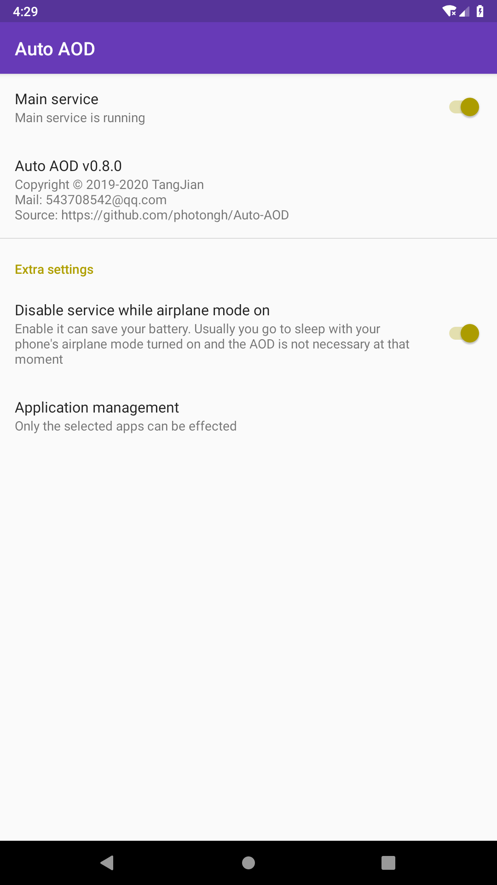
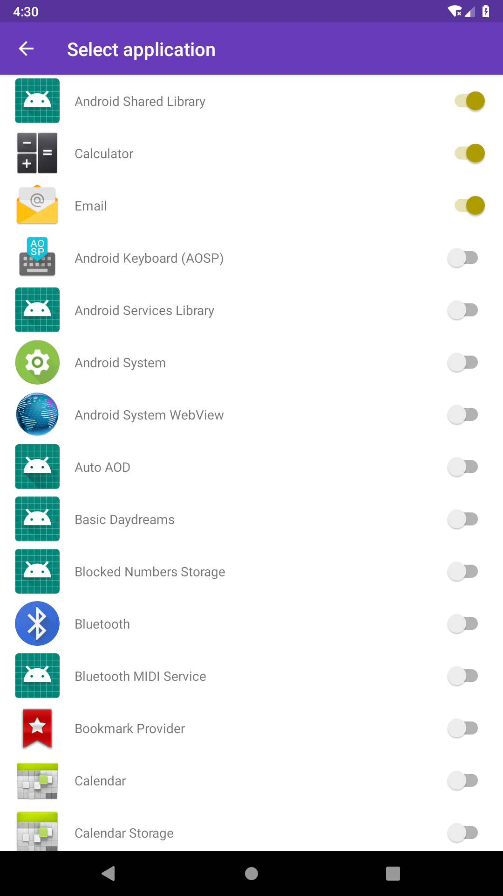

# Auto-AOD

  

Auto AOD is developed for Samsung s10/s10+/s10e. Other phone may be OK too.

As the notification LED is absent on Samsung S10 and Samsung company may not update the software solution, I 
create this app to take advantage of the Samsung's AOD(Always On Display) feature to show me the new un-read 
notifications. Other than some apps before, it just enable the system's AOD when a new notification comes
instead of drawing a circle or showing some info on a black screen. When you unlock your phone, the AOD state 
will be restored. 

This app is desired to save more battery, so it has any permissions/traces and unnecessary functions. 

(For Chinese)To ensure this app can be running forever, Please enable the "Auto Running" of this app
 in system settings.

This is the source for the Auto-AOD

Download: [go](./LICENSE)

[LICENSE](./LICENSE)

