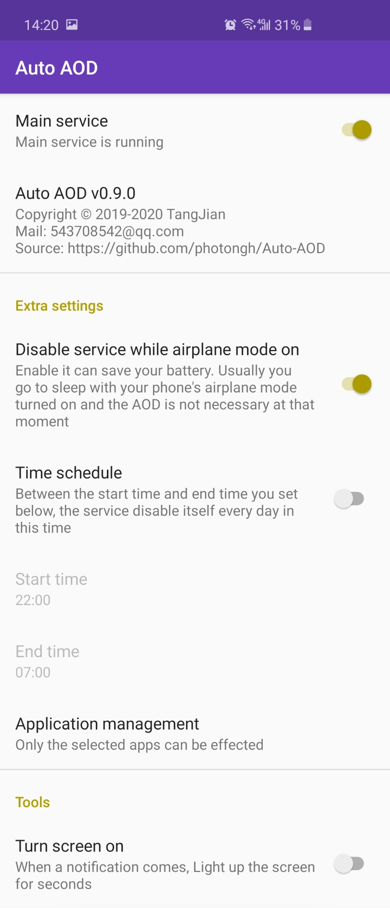
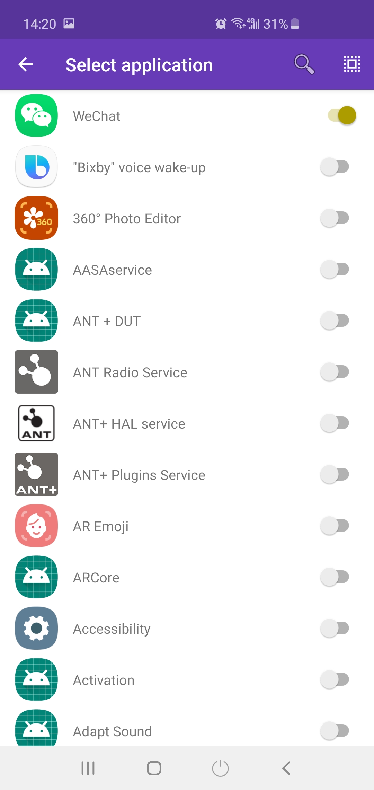

# Auto-AOD




Auto AOD is developed for Samsung s10/s10+/s10e.

As the notification LED is absent on Samsung S10 and Samsung company may not update the software solution, I 
create this app to take advantage of the Samsung's AOD(Always On Display) feature to show me the new un-read 
notifications. Other than some apps before, it just enable the system's AOD when a new notification comes
instead of drawing a circle or showing some info on a black screen. When you unlock your phone, the AOD state 
will be restored. 

This app is desired to save more battery, so it has any permissions/traces and unnecessary functions. 

(For Chinese)To ensure this app can be running forever, Please enable the "Auto Running" of this app
 in system settings.

This is the source for the Auto-AOD, APK Download: [go](https://github.com/photongh/Auto-AOD/releases)

License
---
```
    Copyright (C) 2019-2020 "TangJian"
    
    This program is free software: you can redistribute it and/or modify
    it under the terms of the GNU General Public License as published by
    the Free Software Foundation, either version 3 of the License, or
    (at your option) any later version.
    
    This program is distributed in the hope that it will be useful,
    but WITHOUT ANY WARRANTY; without even the implied warranty of
    MERCHANTABILITY or FITNESS FOR A PARTICULAR PURPOSE.  See the
    GNU General Public License for more details.
    
    You should have received a copy of the GNU General Public License
    along with this program.  If not, see <https://www.gnu.org/licenses/>.
```